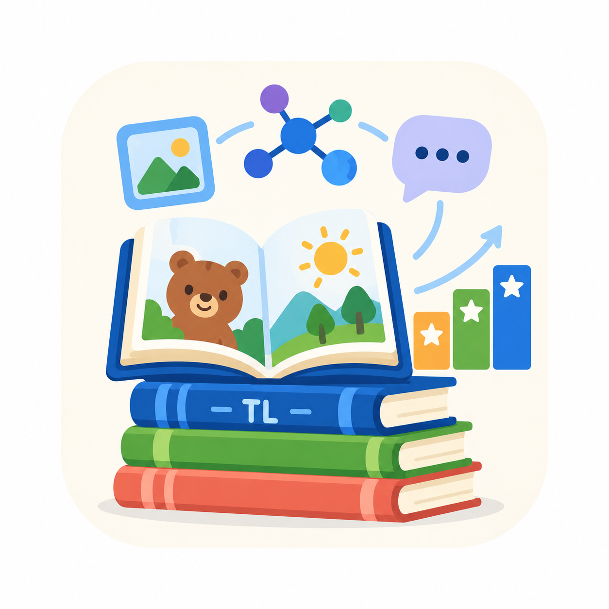

<p align="center">
  
</p>

<h1 align="center">TinyLibrary</h1>

<p align="center">
  Official repository for <strong>“TinyLibrary: Do Age-Graded Curricula Help Small Vision-Language Models?”</strong>
</p>

<p align="center">
  <a href="https://openreview.net/forum?id=3S9UR6Xizi">📄 Paper</a>  |  <a href="https://huggingface.co/datasets/Dheerraa/TinyLibrary">🤗 Dataset</a>
</p>

TinyLibrary investigates whether ordering children's books by age provides a useful curriculum for training small vision-language models. The study is built on 2,416 English-language books from the International Children's Digital Library (ICDL), from which we selected 46,721 illustrated pages and generated 128,823 captioning, visual question-answering, and reasoning samples containing 21.7M words.

## Released materials

This repository contains:

- dataset filtering and annotation-generation code;
- the prompts used for age inference and synthetic annotation generation;
- curriculum construction and nanoVLM training code;
- BabyLM linguistic and multimodal evaluation utilities; and
- analysis inputs and scripts used to produce the paper figures.

The [Hugging Face dataset](https://huggingface.co/datasets/Dheerraa/TinyLibrary) contains the synthetic annotations, per-sample difficulty scores, sample mappings, and curriculum orders used in the experiments.

## Repository layout

```text
analysis/             Result tables and paper-figure generation
environment/          Separate pinned construction and training environments
pipeline/             Filtering, age inference, and annotation generation
playground/prompts/   Prompts used during dataset construction
training/             Curriculum, training, and evaluation code
```

## Setup

Python 3.11 is required for the environments. Corpus construction and training/evaluation use separate dependency profiles because their Transformers requirements are incompatible.

```bash
# Corpus construction
python3.11 -m venv .venv-construction
source .venv-construction/bin/activate
python -m pip install -r environment/requirements-construction.txt
deactivate

# Training and BabyLM evaluation
python3.11 -m venv .venv-training
source .venv-training/bin/activate
python -m pip install -r environment/requirements-training.txt
```

Training uses [nanoVLM](https://github.com/huggingface/nanoVLM), and evaluation uses the [BabyLM 2026 evaluation repository](https://github.com/babylm-org/babylm-eval). The exact experiment revisions and setup commands are recorded in [environment/README.md](environment/README.md). Clone both into your experiment workspace or point `NANOVLM_DIR` and `BABYLM_EVAL_DIR` to their locations.

## Running the experiments

See [pipeline/README.md](pipeline/README.md) for data-construction stages and [training/README.md](training/README.md) for the manifest schema, curriculum definitions, local commands, and parameterized Slurm templates. The Slurm scripts do not contain institution-specific paths or W&B accounts.

Set the experiment workspace before submitting them:

```bash
export TINYLIBRARY_CODE_DIR=/absolute/path/to/TinyLibrary
export TINYLIBRARY_BASE=/path/to/experiment-workspace
export TINYLIBRARY_ACTIVATE=/path/to/venv/bin/activate  # optional
export NANOVLM_DIR=/path/to/nanoVLM                     # optional if under BASE
export BABYLM_EVAL_DIR=/path/to/babylm-eval             # optional if under BASE
export WANDB_PROJECT=tinylibrary                         # optional
export WANDB_ENTITY=your-wandb-entity                   # optional
```

Cluster resources such as the partition, account, and wall-clock limit should be supplied through your own Slurm configuration or `sbatch` arguments.

## License

Except where noted in [THIRD_PARTY_NOTICES.md](THIRD_PARTY_NOTICES.md), the code in this repository is released under the MIT License. This license does not apply to ICDL books or page images. The Hugging Face dataset card will document the scope and provenance of the released derived data.

**Source-data notice:** This repository does not distribute the ICDL books, page images, or OCR text. ICDL material remains subject to its original terms and copyright. Users must obtain any source material independently and ensure that their use is permitted. The public pipeline begins from locally available page images and OCR annotations.


## Citation

```bibtex
@inproceedings{varghese2026tinylibrary,
  title     = {TinyLibrary: Do Age-Graded Curricula Help Small Vision-Language Models?},
  author    = {Dheeraj Varghese},
  booktitle = {BabyLM 2026 Workshop at EMNLP 2026},
  year      = {2026},
  url       = {https://openreview.net/forum?id=3S9UR6Xizi}
}
```